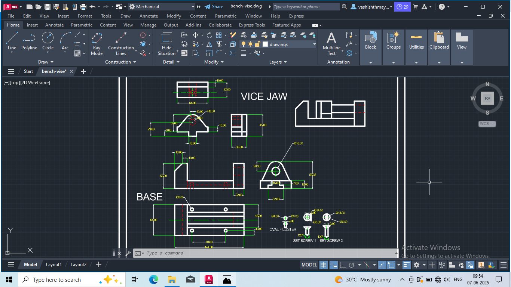

# 🛠️ Bench Vise 2D Drawing

Hi! I'm Mayank, and this is a basic 2D drawing project I made of a **Bench Vise** using AutoCAD. It's a simple project where I tried to show all the main views clearly and neatly. I created this just to improve my CAD skills and get more comfortable with technical drawing.

## 📷 Screenshot

## 🔍 What’s in the Drawing

I’ve shown multiple views of the main parts of the bench vise:

### Main Parts:
- **Base** – Top, Front, and Side views
- **Vice Jaw** – Top, Front, and Side views

### Small Components:
- **Set Screw 1 & 2 (Oval Fillister)** – Top and Front views

I’ve tried to keep the views clean and properly aligned. This is just a beginner-level drawing, but I hope it looks neat and easy to understand.

## 📁 Files Included

- `bench-vise.dwg` – The main AutoCAD file with all the 2D drawings
- `bench-vise.png` – A screenshot of the drawing layout

## 💻 Tools Used

- **AutoCAD** – for all the 2D drafting
- Just basic tools like line, circle, trim, etc.

## 👤 About Me

My name is **Mayank** and I’m learning CAD and mechanical design.  
You can find me on GitHub here: [@vashmayank](https://github.com/vashmayank)

## 🙌 Thanks

Thanks for checking out my project! If you have any feedback or tips to improve it, feel free to let me know.

